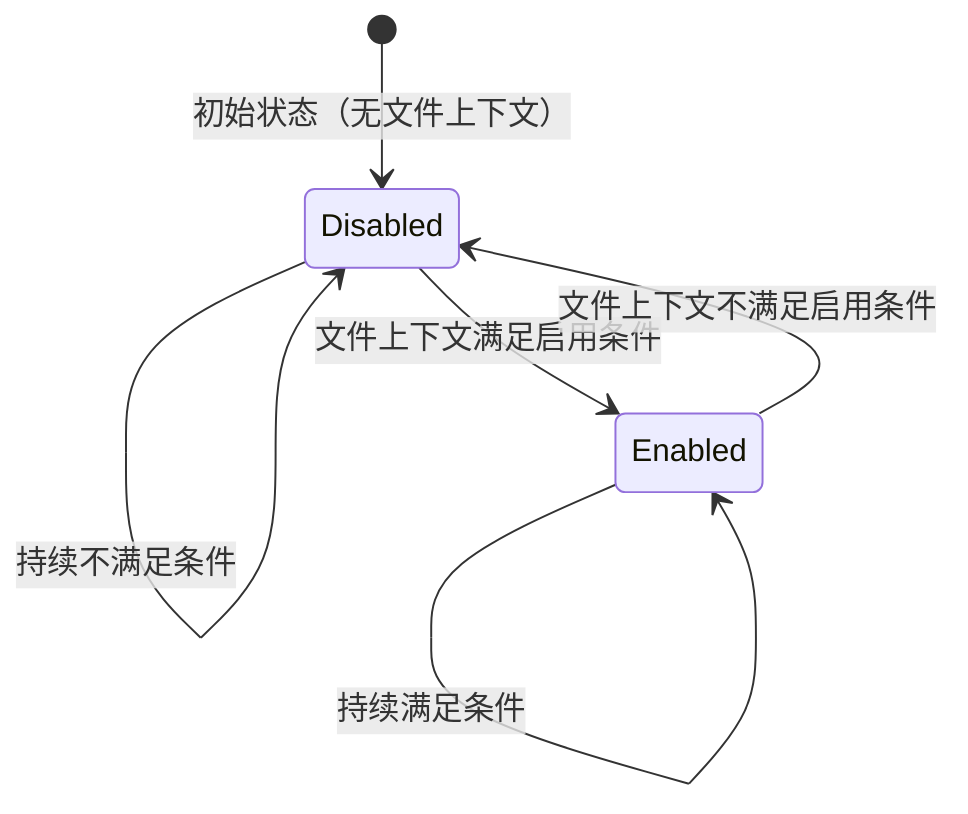
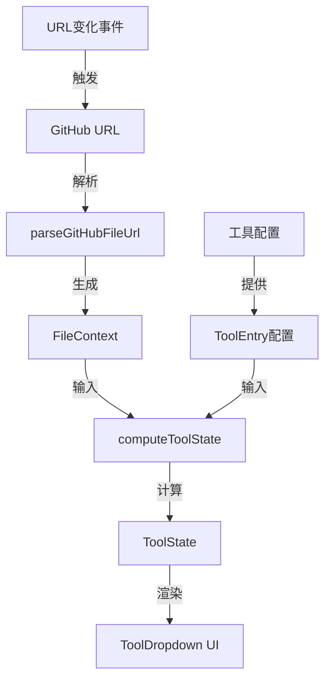

# 数据模型：针对 GitHub 文件路径点亮工具菜单

**功能**: 003-file-path-tools  
**日期**: 2025-11-16  
**目的**: 定义功能所需的核心数据实体、关系和验证规则

## 数据模型概述

本功能引入 3 个核心数据实体和 1 个配置增强，用于表示文件上下文、工具状态和启用条件。所有实体均为前端内存数据结构，无需持久化。

---

## 实体 1: FileContext（文件上下文）

### 描述

表示从 GitHub URL 解析出的文件页面上下文信息，用于判断工具启用条件和生成目标 URL。

### 字段定义

| 字段 | 类型 | 必填 | 描述 | 示例 |
|------|------|------|------|------|
| `owner` | `string` | ✅ | 仓库所有者（用户名或组织名） | `"microsoft"` |
| `repo` | `string` | ✅ | 仓库名称 | `"vscode"` |
| `ref` | `string` | ✅ | Git 引用（分支/标签/commit hash） | `"main"`, `"v1.0.0"`, `"a1b2c3d"` |
| `filePath` | `string` | ✅ | 文件路径（相对于仓库根目录，保留 URL 编码） | `"src/index.ts"`, `"my%20file.md"` |
| `extension` | `string` | ✅ | 文件扩展名（小写，不含点号） | `"ts"`, `"ipynb"`, `"md"` |
| `query` | `string \| null` | ❌ | URL 查询字符串（含 `?`） | `"?plain=1"`, `null` |
| `hash` | `string \| null` | ❌ | URL 哈希片段（含 `#`） | `"#L20-L30"`, `null` |
| `currentUrl` | `string` | ✅ | 完整 GitHub URL | `"https://github.com/..."` |

### 验证规则

```typescript
// 验证 FileContext 是否有效
function isValidFileContext(context: FileContext): boolean {
  return (
    context.owner.length > 0 && context.owner.length <= 39 &&
    context.repo.length > 0 && context.repo.length <= 100 &&
    context.ref.length > 0 &&
    context.filePath.length > 0 &&
    context.extension.length > 0
  );
}
```

**字段约束**:
- `owner`: 1-39 字符，GitHub 用户名长度限制
- `repo`: 1-100 字符，GitHub 仓库名长度限制
- `ref`: 非空，可以是任意合法 Git 引用
- `filePath`: 非空，必须包含至少一个文件名
- `extension`: 非空，从 `filePath` 提取

### 状态转换

FileContext 是**不可变对象**（immutable），由 URL 解析函数生成，不支持状态转换。每次 URL 变化时重新解析生成新实例。

```typescript
// 状态转换示例（实际是创建新实例）
const oldContext = parseGitHubFileUrl('https://github.com/owner/repo/blob/main/file1.md');
// 用户导航到新页面
const newContext = parseGitHubFileUrl('https://github.com/owner/repo/blob/main/file2.ts');
```

### 关系

- **被使用于**: `ToolState` 计算（输入参数）
- **被生成于**: `parseGitHubFileUrl()` 函数（URL 解析）

---

## 实体 2: ToolState（工具状态）

### 描述

表示单个工具在特定文件上下文下的启用状态，包含是否启用、生成的 URL 和禁用原因。

### 字段定义

| 字段 | 类型 | 必填 | 描述 | 示例 |
|------|------|------|------|------|
| `toolName` | `string` | ✅ | 工具名称（唯一标识） | `"githistory"`, `"nbviewer"` |
| `enabled` | `boolean` | ✅ | 是否启用 | `true`, `false` |
| `url` | `string \| null` | ✅ | 生成的目标 URL（仅在 `enabled=true` 时有值） | `"https://github.githistory.xyz/..."`, `null` |
| `disabledReason` | `string \| null` | ❌ | 禁用原因（仅在 `enabled=false` 时有值） | `"仅适用于文件页面"`, `null` |

### 验证规则

```typescript
// 验证 ToolState 逻辑一致性
function isValidToolState(state: ToolState): boolean {
  if (state.enabled) {
    return state.url !== null && state.disabledReason === null;
  } else {
    return state.url === null && state.disabledReason !== null;
  }
}
```

**逻辑约束**:
- `enabled=true` 时，`url` 必须非空，`disabledReason` 必须为 `null`
- `enabled=false` 时，`url` 必须为 `null`，`disabledReason` 应有值（可选，用于 UI 提示）

### 状态转换

ToolState 根据 FileContext 重新计算，支持以下状态转换：



**转换触发条件**:
- URL 变化（用户导航）
- 工具配置变化（极少见，通常为扩展更新）

### 关系

- **关联工具**: 每个 ToolState 对应一个 `ToolEntry`（工具配置）
- **依赖上下文**: 由 `FileContext` 计算生成
- **被使用于**: UI 渲染（`ToolDropdown` 组件）

---

## 实体 3: ToolEnableCondition（工具启用条件）

### 描述

定义工具的启用条件，作为 `ToolEntry` 的可选配置字段，用于声明式描述工具可用范围。

### 字段定义

| 字段 | 类型 | 必填 | 描述 | 示例 |
|------|------|------|------|------|
| `requiresFilePath` | `boolean` | ❌ | 是否需要文件路径（区分文件页面 vs 仓库主页） | `true`（githistory）, `false`（默认） |
| `fileExtensions` | `string[]` | ❌ | 支持的文件扩展名列表（小写，不含点号）；空数组表示支持所有扩展名 | `["ipynb"]`（nbviewer）, `[]`（githistory） |

### 验证规则

```typescript
// 验证 ToolEnableCondition 配置
function isValidEnableCondition(condition: ToolEnableCondition): boolean {
  if (condition.fileExtensions) {
    return condition.fileExtensions.every(ext => 
      ext.length > 0 && ext === ext.toLowerCase() && !ext.includes('.')
    );
  }
  return true;
}
```

**字段约束**:
- `fileExtensions`: 所有扩展名必须为小写、非空、不含点号（如 `"ipynb"` 而非 `".ipynb"`）
- `requiresFilePath`: 为 `true` 时，工具仅在文件页面启用；为 `false` 或未定义时，工具在所有仓库页面启用

### 关系

- **嵌入于**: `ToolEntry` 配置对象
- **被使用于**: `computeToolState()` 函数（启用条件判断）

---

## 配置增强: ToolEntry（工具配置）

### 修改说明

为现有 `ToolEntry` 接口新增可选的 `enableCondition` 字段，向后兼容现有配置。

### 修改前后对比

```typescript
// 修改前
export interface ToolEntry {
  name: string;
  urlTemplate: string;
  order: number;
  iconPath: string;
  note?: string;
}

// 修改后
export interface ToolEntry {
  name: string;
  urlTemplate: string;  // 支持新占位符 {ref}, {filepath}
  order: number;
  iconPath: string;
  note?: string;
  enableCondition?: ToolEnableCondition;  // 新增：启用条件
}
```

### 配置示例

```typescript
// githistory 配置（需要文件路径，支持所有扩展名）
{
  name: 'githistory',
  urlTemplate: 'https://github.githistory.xyz/{owner}/{repo}/blob/{ref}/{filepath}',
  order: 9,
  iconPath: 'logo/githistory-16x16.png',
  note: 'optimal for file/folder paths',
  enableCondition: {
    requiresFilePath: true,
    fileExtensions: [],  // 空数组表示支持所有扩展名
  }
}

// nbviewer 配置（需要文件路径，仅支持 .ipynb）
{
  name: 'nbviewer',
  urlTemplate: 'https://nbviewer.org/github/{owner}/{repo}/blob/{ref}/{filepath}',
  order: 6,
  iconPath: 'logo/nbviewer.org-16x16.png',
  note: 'optimal for .ipynb files',
  enableCondition: {
    requiresFilePath: true,
    fileExtensions: ['ipynb'],
  }
}

// GitHub.dev 配置（无启用条件，所有页面可用）
{
  name: 'GitHub.dev',
  urlTemplate: 'https://github.dev/{owner}/{repo}',
  order: 1,
  iconPath: 'logo/github.dev-16x16.png',
  // enableCondition 未定义，默认所有页面启用
}
```

---

## 数据流图



**数据流说明**:
1. 用户导航触发 URL 变化事件
2. `parseGitHubFileUrl()` 解析当前 URL，生成 `FileContext`
3. `computeToolState()` 结合 `FileContext` 和 `ToolEntry` 配置，计算 `ToolState`
4. `ToolDropdown` 组件根据 `ToolState` 渲染启用/禁用的菜单项
5. 缓存层（未图示）可缓存 `FileContext` → `Map<toolName, ToolState>` 映射

---

## 缓存策略

### 缓存键设计

```typescript
// 缓存 Key: FileContext 的唯一标识（使用 URL）
type CacheKey = string;  // 简化实现：使用 URL 前缀

function getCacheKey(context: FileContext): CacheKey {
  return context.currentUrl.slice(0, 100);  // 取前 100 字符作为 key
}
```

### 缓存值设计

```typescript
// 缓存 Value: 所有工具的状态映射
type CacheValue = Map<string, ToolState>;  // toolName -> ToolState

const cache = new Map<CacheKey, CacheValue>();
```

### 缓存失效规则

**失效触发条件**:
1. URL 变化（新的 `FileContext`）
2. 工具配置变化（极少见，通常为扩展更新）
3. 缓存大小超限（LRU 策略，最多缓存 100 个 URL）

**实现**:
```typescript
const MAX_CACHE_SIZE = 100;

function updateCache(key: CacheKey, value: CacheValue): void {
  if (cache.size >= MAX_CACHE_SIZE) {
    // LRU: 删除最早的缓存项
    const firstKey = cache.keys().next().value;
    cache.delete(firstKey);
  }
  cache.set(key, value);
}
```

---

## 类型定义汇总

```typescript
/**
 * 文件上下文（从 GitHub 文件 URL 解析）
 */
export interface FileContext {
  owner: string;
  repo: string;
  ref: string;
  filePath: string;
  extension: string;
  query: string | null;
  hash: string | null;
  currentUrl: string;
}

/**
 * 工具启用条件
 */
export interface ToolEnableCondition {
  requiresFilePath?: boolean;
  fileExtensions?: string[];
}

/**
 * 工具配置（扩展现有 ToolEntry）
 */
export interface ToolEntry {
  name: string;
  urlTemplate: string;
  order: number;
  iconPath: string;
  note?: string;
  enableCondition?: ToolEnableCondition;
}

/**
 * 工具状态（计算结果）
 */
export interface ToolState {
  toolName: string;
  enabled: boolean;
  url: string | null;
  disabledReason: string | null;
}

/**
 * 工具状态管理器接口
 */
export interface IToolStateManager {
  computeToolState(tool: ToolEntry, context: FileContext | null): ToolState;
  computeAllToolStates(context: FileContext | null): Map<string, ToolState>;
}
```

---

## 测试数据示例

### 示例 1: 普通文件页面（启用 githistory）

```typescript
// 输入 URL
const url = 'https://github.com/microsoft/vscode/blob/main/README.md';

// 解析后的 FileContext
const fileContext: FileContext = {
  owner: 'microsoft',
  repo: 'vscode',
  ref: 'main',
  filePath: 'README.md',
  extension: 'md',
  query: null,
  hash: null,
  currentUrl: url,
};

// githistory 工具状态
const githistoryState: ToolState = {
  toolName: 'githistory',
  enabled: true,
  url: 'https://github.githistory.xyz/microsoft/vscode/blob/main/README.md',
  disabledReason: null,
};

// nbviewer 工具状态
const nbviewerState: ToolState = {
  toolName: 'nbviewer',
  enabled: false,
  url: null,
  disabledReason: '仅适用于 .ipynb 文件',
};
```

### 示例 2: Notebook 文件页面（启用 githistory 和 nbviewer）

```typescript
// 输入 URL
const url = 'https://github.com/owner/repo/blob/main/analysis.ipynb';

// 解析后的 FileContext
const fileContext: FileContext = {
  owner: 'owner',
  repo: 'repo',
  ref: 'main',
  filePath: 'analysis.ipynb',
  extension: 'ipynb',
  query: null,
  hash: null,
  currentUrl: url,
};

// githistory 工具状态
const githistoryState: ToolState = {
  toolName: 'githistory',
  enabled: true,
  url: 'https://github.githistory.xyz/owner/repo/blob/main/analysis.ipynb',
  disabledReason: null,
};

// nbviewer 工具状态
const nbviewerState: ToolState = {
  toolName: 'nbviewer',
  enabled: true,
  url: 'https://nbviewer.org/github/owner/repo/blob/main/analysis.ipynb',
  disabledReason: null,
};
```

### 示例 3: 仓库主页（禁用所有文件工具）

```typescript
// 输入 URL
const url = 'https://github.com/owner/repo';

// 解析后的 FileContext（null，无法解析文件上下文）
const fileContext = null;

// githistory 工具状态
const githistoryState: ToolState = {
  toolName: 'githistory',
  enabled: false,
  url: null,
  disabledReason: '仅适用于文件页面',
};

// nbviewer 工具状态
const nbviewerState: ToolState = {
  toolName: 'nbviewer',
  enabled: false,
  url: null,
  disabledReason: '仅适用于 .ipynb 文件页面',
};

// GitHub.dev 工具状态（无启用条件，仍可用）
const githubdevState: ToolState = {
  toolName: 'GitHub.dev',
  enabled: true,
  url: 'https://github.dev/owner/repo',
  disabledReason: null,
};
```

---

## 总结

本数据模型定义了 3 个核心实体（FileContext、ToolState、ToolEnableCondition）和 1 个配置增强（ToolEntry），所有实体均为前端内存数据结构，无需持久化。数据流清晰（URL → FileContext → ToolState → UI），缓存策略简单高效，类型定义完整，可直接用于实施阶段。
